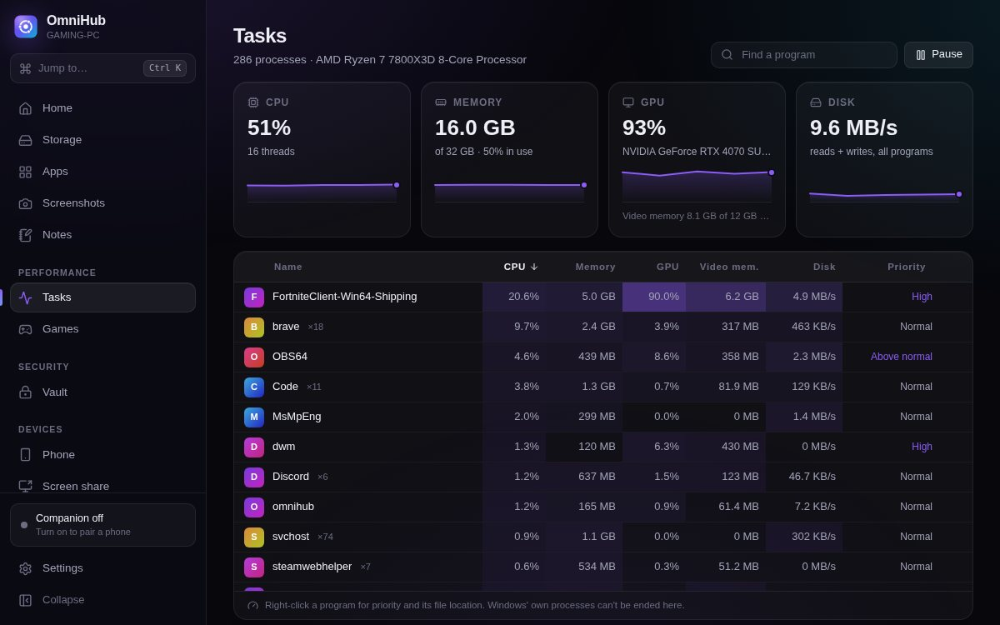
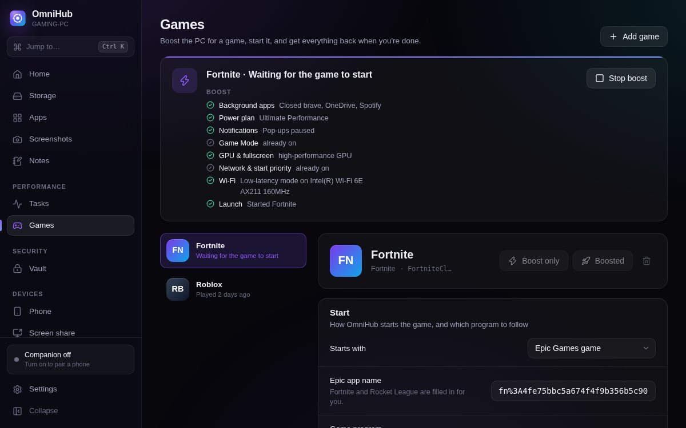
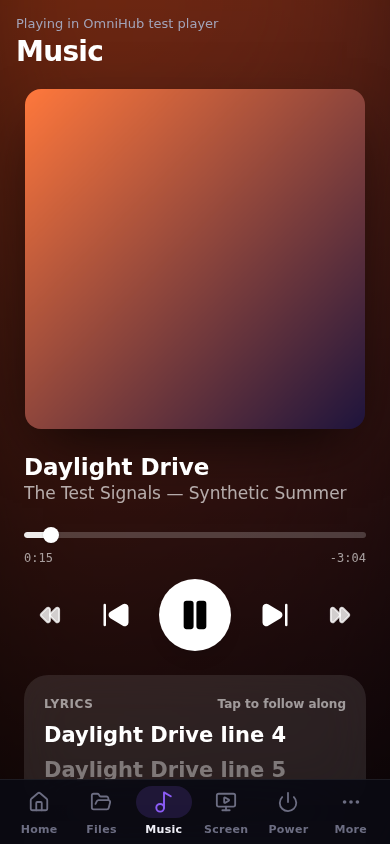
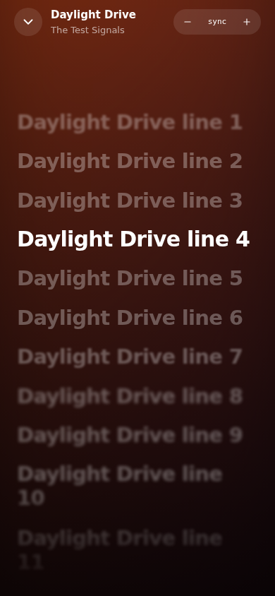
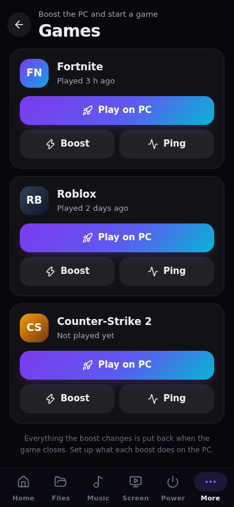

# OmniHub

A Windows companion for your PC: see what fills your drives in seconds, keep
notes and ideas for Claude, store passwords in a local encrypted vault (with
autofill in Brave, Chrome and Edge), boost the PC for games, see what every
program uses, and use your phone to move files, control the music with
synced lyrics, start a game or watch the PC's screen.

**[Download the latest release](https://github.com/Kerioxsx/omnihub/releases/latest)**
(Windows 10/11, 64-bit) · **[Website and tour](https://kerioxsx.github.io/omnihub/)**

Built from [`docs/PLAN.md`](docs/PLAN.md). Desktop app: Tauri 2 (Rust) +
React. Phone: a web app served by the PC itself — nothing to install from a
store, no cloud.

| | |
|---|---|
| **Storage** | Reads the NTFS Master File Table directly (the WizTree/Everything technique) and keeps it up to date from the USN change journal. Treemap, largest files, file types, search, cleanup suggestions, duplicates. Falls back to a parallel folder walk without admin rights or on FAT/exFAT/network drives. |
| **Apps** | Desktop programs, Store apps and Start menu entries with icons, size (from the latest scan), launch, uninstall, and the screenshots you took in each. |
| **Screenshots** | Region (frozen-screen overlay), screen, window, all screens; global hotkeys; a searchable library with tags, notes and favourites. Files stay normal PNG/JPEG files in *Pictures\OmniHub Screenshots*. |
| **Notes & ideas** | Markdown notes. "Ideas for Claude" are written as `.md` files (YAML front matter, optional JSON sidecar, an `INDEX.md`) into a folder you choose; the folder is watched so replies Claude writes there show up. |
| **Vault** | Passwords, logins, Wi-Fi keys and secure notes, encrypted with Argon2id + AES-256-GCM and bound to your Windows account with DPAPI. Auto-lock, lock with Windows, Windows Hello unlock, clipboard that clears itself and stays out of clipboard history. Two-factor codes (TOTP), a password health report with an optional breach check, and **autofill in Brave, Chrome and Edge** through a small extension that talks only to the app on your PC. |
| **Tasks** | CPU, memory, **GPU**, video memory and disk use of every program, live, like Task Manager — with End task, priority and file location. Also on the phone. |
| **Games** | A boost profile per game (Fortnite, Roblox, VALORANT, CS2, Apex, Rocket League, League, GTA V, Call of Duty or any program): power plan, background apps, notifications, GPU choice, game priority, Wi-Fi low-latency mode and network priority — applied when you press Play and put back when the game closes. A ping helper (latency, jitter, loss per region) and Roblox Fast Flag presets. |
| **Music** | What the PC plays (Spotify, Apple Music, browsers…) on your phone: cover, play/pause/skip/seek, volume, bass and treble (with Equalizer APO), and time-synced lyrics in an Apple Music–style view. |
| **Phone** | Pair by QR code or PIN. Volume of each app, mute the microphone and control calls (Discord, WhatsApp, Nyxen…), close or quit open apps. Browse shared folders, download with resume, upload big files with resume and checksums, receive files from the PC, lock/sleep/restart/shut down with a cancellable countdown, music with lyrics, tasks, start games with their boost, launch apps, jot ideas, read the vault (opt-in, HTTPS only). |
| **Screen sharing** | PC → phone in any browser (desktop duplication, adaptive JPEG stream, optional mouse/keyboard control, pause or share one window for privacy). For 4K60 it hands off to Sunshine + Moonlight; Android → PC uses scrcpy, and **iPhone → PC** uses AirPlay (a UxPlay add-on OmniHub downloads and checks for you). |

## New in 0.2.6

- No more "Error writing to file … omnihub.exe" when installing: the installers close every running OmniHub first (also the browser extension's hidden helper, which now runs from a copy in the data folder), and OmniHub closes when Windows or an installer asks.

## New in 0.2.5

- The setup and automatic updates work when OmniHub is in Program Files: they ask for administrator approval instead of failing with "Error writing to file" (automatic updates wait for your click there).

## New in 0.2.4

- The AirPlay receiver uses the video and sound outputs it is tested with. It says how it ended if it closes, and offers a safe mode (software video).
- Automatic updates wait until OmniHub is in the tray and say "Updated to …" afterwards.
- After an unexpected close, the next start offers "Copy details" (OmniHub's log plus Windows' crash summaries), and a page error no longer blanks the window.

## New in 0.2.3

- iPhone → PC mirroring announces the PC's Wi-Fi address (it could pick a VPN or virtual adapter before) and checks that iPhones can find it.
- Calls are only calling apps recording from the microphone right now — no more "in a call" for a game's voice chat or a call that already ended.
- The phone's screen viewer covers the whole screen and has a working full-screen button on iPhone.

## New in 0.2.2

- **Volume & calls** on the phone: each app's volume and mute, the PC's volume, mute the microphone in every app, and Mute mic / Deafen for a call in Discord, WhatsApp, Nyxen, Teams or a browser.
- **Open apps** on the phone: close any program (like clicking ×) or quit it.
- **Music in landscape**, and play/pause, skip and volume in the full-screen lyrics.

## New in 0.2.1

- Phones on Wi-Fi could not reach the PC on Windows ("site can't be reached"): fixed, plus a self-test in Phone → Connection check.
- **Updates install from inside the app** (Settings → About), automatically by default.
- **Approve fast scans once** instead of a Windows prompt every time (Settings → Storage).

## New in 0.2.0

- **Games** page: boost profiles, Play/Boost from the PC or the phone, ping helper, Roblox Fast Flags.
- **Tasks** page: per-program CPU, memory, GPU, video memory and disk; priority and End task; on the phone too.
- **Music** on the phone: synced lyrics, cover art, controls, volume, bass/treble.
- **Browser autofill** for the vault (Brave, Chrome, Edge), TOTP codes, password health.
- **iPhone mirroring** to the PC over AirPlay; screen-share privacy (pause, one window).
- PC → phone sending, storage view modes, storage growth report, startup apps, screenshot markup and text recognition, note reminders and templates, settings backup — and the greeting uses *your* name (from Windows, or Settings → General → Your name).

## Screenshots

The desktop app (shown with its built-in demo data) and the phone app (talking to a real OmniHub server):

| | |
|---|---|
|  |  |
|  |  |
|  |  |
|  |  |

<p>


</p>
<p>



</p>

## How fast is the storage scan?

On a real Windows system drive with 1.15 million files and 212,000 folders
(GitHub's Windows runner), the MFT is read and parsed in **3.3 s** and the
browsable tree is built in **0.25 s**; refreshing it afterwards through the
USN change journal took **0.4 s**. (A folder walk has to ask the file system
about every directory and is typically many times slower.) The time grows with the number of files, not with drive
size, so a 4 TB drive full of large media files scans faster than a small
system drive. See [`docs/BENCHMARKS.md`](docs/BENCHMARKS.md).

## Decisions on the plan's open questions

1. **Phone platform** — Android first (best screen mirroring via scrcpy); the phone web app itself works the same on iOS.
2. **PWA for v1** — yes. The PC serves the app; add it to the home screen.
3. **Screen sharing** — both: a built-in stream that needs nothing installed, plus bridges to Sunshine/Moonlight (PC → phone, 4K60, hardware encode) and scrcpy (Android → PC). See [`docs/SCREEN_SHARE.md`](docs/SCREEN_SHARE.md).
4. **Claude ideas folder** — Markdown with YAML front matter by default; JSON sidecars and `INDEX.md` are options.
5. **Name** — OmniHub (working title kept).
6. **Network** — LAN only (private addresses; Tailscale's range can be allowed in settings). No cloud relay. The few internet requests are listed in [`docs/SECURITY.md`](docs/SECURITY.md#internet).

## Security in one paragraph

OmniHub runs as a normal user. Administrator rights are requested through UAC
only for the fast MFT scan, in a short-lived helper process. The phone server
is **off** until you turn it on, accepts only private-network addresses,
requires pairing (with the PC in front of you) and a per-device token, uses
HTTPS with a certificate generated on your PC, and logs power actions,
transfers, vault reveals and remote control in an audit log. Remote control
and phone vault access are separate opt-ins. Details:
[`docs/SECURITY.md`](docs/SECURITY.md).

## Install

1. Open [Releases](https://github.com/Kerioxsx/omnihub/releases/latest) and
   download `OmniHub_<version>_x64-setup.exe` (an `.msi` is there too).
2. Run it. It installs per user, so no administrator rights are needed.
   Windows 10/11; WebView2 is installed automatically if missing.
3. The installer is not code-signed yet, so SmartScreen warns: click
   **More info → Run anyway**.

Or build it yourself (below).

## Build

Requirements: Rust through rustup (the pinned version installs itself),
Node.js 22, and on Windows the MSVC build tools.

```sh
git clone https://github.com/Kerioxsx/omnihub && cd omnihub
npm ci
npm run build                 # desktop UI → dist/, phone app → dist-mobile/
npx tauri build               # Windows installer (NSIS + MSI)
```

Development:

```sh
npx tauri dev                 # desktop app with hot reload (Windows)
npm run dev                   # desktop UI in a browser with mock data (any OS)
cargo run -p omnihub-core --bin omnihub-headless -- --http --pair   # phone server only
npm run dev:mobile            # phone app with hot reload, proxied to that server
```

Tests:

```sh
cargo test -p omnihub-core                                  # unit + server end-to-end
sudo scripts/make-ntfs-fixtures.sh target/ntfs-fixtures     # Linux, needs ntfs-3g
OMNIHUB_NTFS_FIXTURES=$PWD/target/ntfs-fixtures cargo test -p omnihub-core --test ntfs_images
```

More in [`docs/DEVELOPMENT.md`](docs/DEVELOPMENT.md); the code layout is in
[`docs/ARCHITECTURE.md`](docs/ARCHITECTURE.md).

## Layout

```
omnihub/
├── crates/omnihub-core/   Rust: storage, vault, notes, apps, capture, music, tasks, games, phone server
├── browser-extension/     Brave/Chrome/Edge autofill extension (talks to the app over native messaging)
├── src-tauri/             Tauri shell: window, tray, hotkeys, region overlay, commands
├── src/desktop/           Desktop UI (React)
├── src/mobile/            Phone web app (React)
├── src/shared/            Types, formatting and design tokens shared by both UIs
├── mobile/                Phone app entry, manifest, service worker, icons
├── scripts/               NTFS fixture and benchmark image builders
└── docs/                  Plan, architecture, security, screen sharing, benchmarks
```
