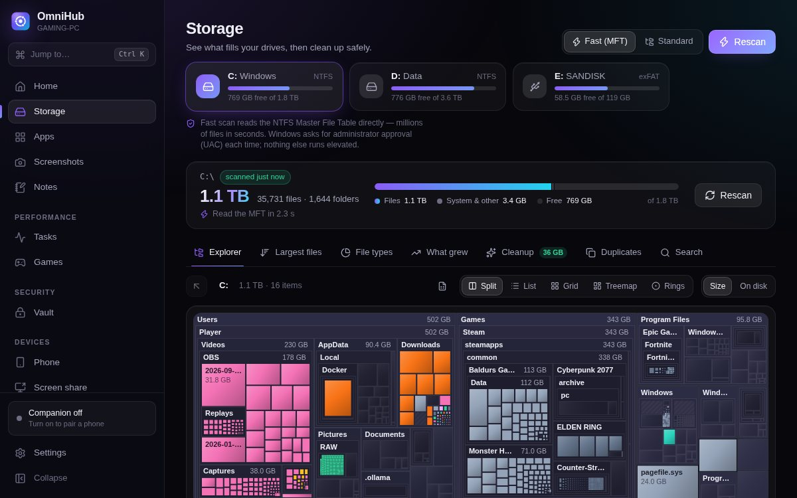
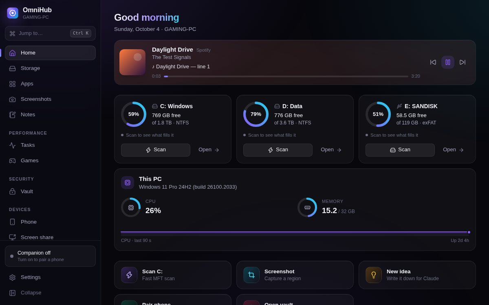
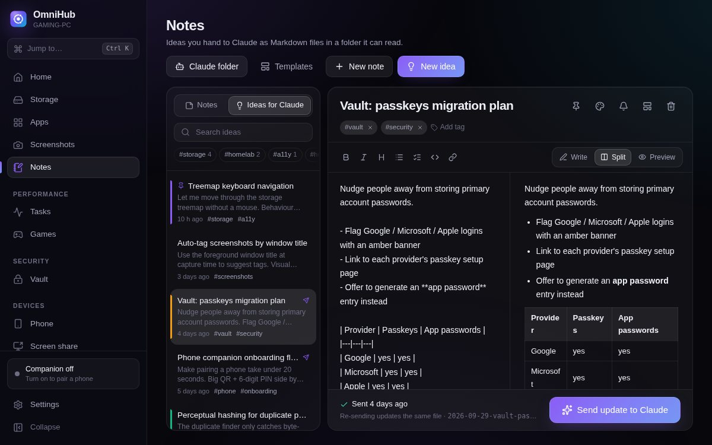
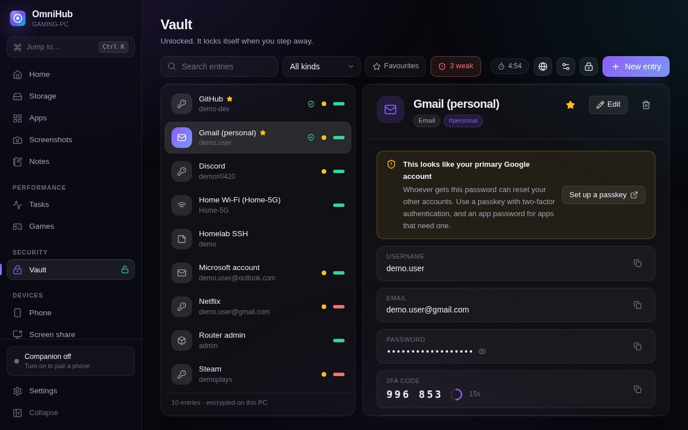
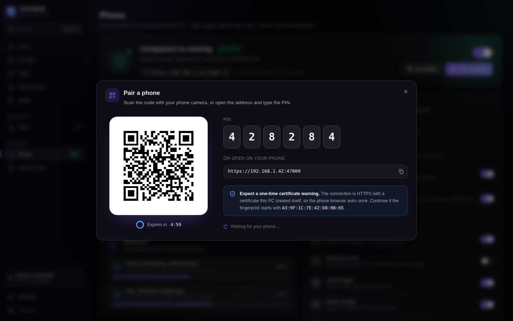
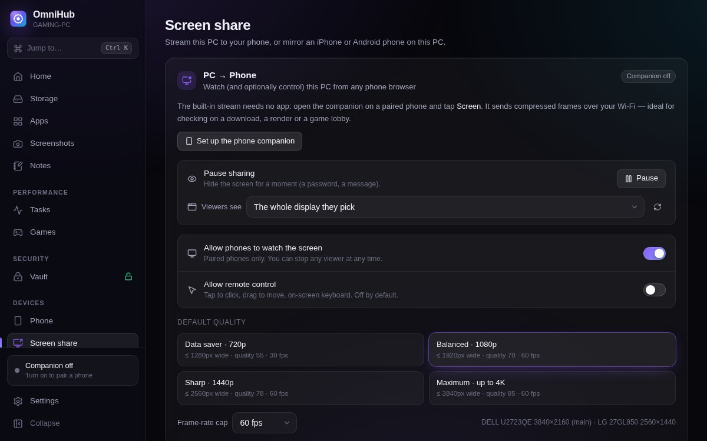
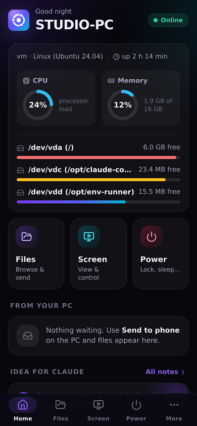
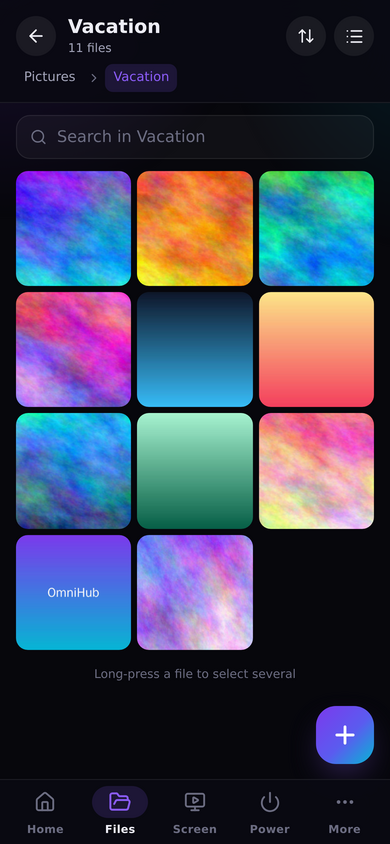
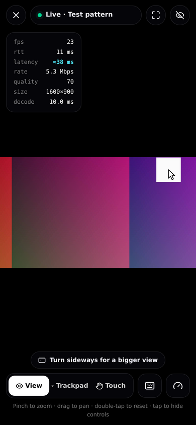
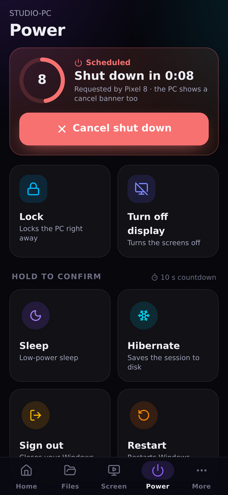

# OmniHub

A Windows companion for your PC: see what fills your drives in seconds, keep
notes and ideas for Claude, store passwords in a local encrypted vault, and
use your phone to move files, shut the PC down or watch its screen.

Built from [`docs/PLAN.md`](docs/PLAN.md). Desktop app: Tauri 2 (Rust) +
React. Phone: a web app served by the PC itself — nothing to install from a
store, no cloud.

| | |
|---|---|
| **Storage** | Reads the NTFS Master File Table directly (the WizTree/Everything technique) and keeps it up to date from the USN change journal. Treemap, largest files, file types, search, cleanup suggestions, duplicates. Falls back to a parallel folder walk without admin rights or on FAT/exFAT/network drives. |
| **Apps** | Desktop programs, Store apps and Start menu entries with icons, size (from the latest scan), launch, uninstall, and the screenshots you took in each. |
| **Screenshots** | Region (frozen-screen overlay), screen, window, all screens; global hotkeys; a searchable library with tags, notes and favourites. Files stay normal PNG/JPEG files in *Pictures\OmniHub Screenshots*. |
| **Notes & ideas** | Markdown notes. "Ideas for Claude" are written as `.md` files (YAML front matter, optional JSON sidecar, an `INDEX.md`) into a folder you choose; the folder is watched so replies Claude writes there show up. |
| **Vault** | Passwords, logins, Wi-Fi keys and secure notes, encrypted with Argon2id + AES-256-GCM and bound to your Windows account with DPAPI. Auto-lock, lock with Windows, Windows Hello unlock, clipboard that clears itself and stays out of clipboard history. |
| **Phone** | Pair by QR code or PIN. Browse shared folders, download with resume, upload big files with resume and checksums, receive files from the PC, lock/sleep/restart/shut down with a cancellable countdown, launch apps, jot ideas, read the vault (opt-in, HTTPS only). |
| **Screen sharing** | PC → phone in any browser (desktop duplication, adaptive JPEG stream, optional mouse/keyboard control). For 4K60 it hands off to Sunshine + Moonlight; Android → PC uses scrcpy, which OmniHub finds, configures and launches. |

## Screenshots

The desktop app (shown with its built-in demo data) and the phone app (talking to a real OmniHub server):

| | |
|---|---|
|  |  |
|  |  |
|  |  |

<p>




</p>

## How fast is the storage scan?

On a real Windows system drive with 1.15 million files and 212,000 folders
(GitHub's Windows runner), the MFT is read and parsed in **3.3 s** and the
browsable tree is built in **0.25 s**; refreshing it afterwards through the
USN change journal took **0.4 s**. (A folder walk has to ask the file system
about every directory and is typically many times slower.) The time grows with the number of files, not with drive
size, so a 4 TB drive full of large media files scans faster than a small
system drive. See [`docs/BENCHMARKS.md`](docs/BENCHMARKS.md).

## Decisions on the plan's open questions

1. **Phone platform** — Android first (best screen mirroring via scrcpy); the phone web app itself works the same on iOS.
2. **PWA for v1** — yes. The PC serves the app; add it to the home screen.
3. **Screen sharing** — both: a built-in stream that needs nothing installed, plus bridges to Sunshine/Moonlight (PC → phone, 4K60, hardware encode) and scrcpy (Android → PC). See [`docs/SCREEN_SHARE.md`](docs/SCREEN_SHARE.md).
4. **Claude ideas folder** — Markdown with YAML front matter by default; JSON sidecars and `INDEX.md` are options.
5. **Name** — OmniHub (working title kept).
6. **Network** — LAN only in v1 (private addresses; Tailscale's range can be allowed in settings). No cloud relay.

## Security in one paragraph

OmniHub runs as a normal user. Administrator rights are requested through UAC
only for the fast MFT scan, in a short-lived helper process. The phone server
is **off** until you turn it on, accepts only private-network addresses,
requires pairing (with the PC in front of you) and a per-device token, uses
HTTPS with a certificate generated on your PC, and logs power actions,
transfers, vault reveals and remote control in an audit log. Remote control
and phone vault access are separate opt-ins. Details:
[`docs/SECURITY.md`](docs/SECURITY.md).

## Install

Download the installer from the CI artifacts (`omnihub-windows-installer`)
or build it yourself (below). It installs per user — no administrator rights
needed. Windows 10/11; WebView2 is installed automatically if missing.

## Build

Requirements: Rust (stable), Node.js 22, and on Windows the MSVC build tools.

```sh
cd omnihub
npm ci
npm run build                 # desktop UI → dist/, phone app → dist-mobile/
npx tauri build               # Windows installer (NSIS + MSI)
```

Development:

```sh
npx tauri dev                 # desktop app with hot reload (Windows)
npm run dev                   # desktop UI in a browser with mock data (any OS)
cargo run -p omnihub-core --bin omnihub-headless -- --http --pair   # phone server only
npm run dev:mobile            # phone app with hot reload, proxied to that server
```

Tests:

```sh
cargo test -p omnihub-core                                  # unit + server end-to-end
sudo scripts/make-ntfs-fixtures.sh target/ntfs-fixtures     # Linux, needs ntfs-3g
OMNIHUB_NTFS_FIXTURES=$PWD/target/ntfs-fixtures cargo test -p omnihub-core --test ntfs_images
```

More in [`docs/DEVELOPMENT.md`](docs/DEVELOPMENT.md); the code layout is in
[`docs/ARCHITECTURE.md`](docs/ARCHITECTURE.md).

## Layout

```
omnihub/
├── crates/omnihub-core/   Rust: storage engine, vault, notes, apps, capture, phone server
├── src-tauri/             Tauri shell: window, tray, hotkeys, region overlay, commands
├── src/desktop/           Desktop UI (React)
├── src/mobile/            Phone web app (React)
├── src/shared/            Types, formatting and design tokens shared by both UIs
├── mobile/                Phone app entry, manifest, service worker, icons
├── scripts/               NTFS fixture and benchmark image builders
└── docs/                  Plan, architecture, security, screen sharing, benchmarks
```
